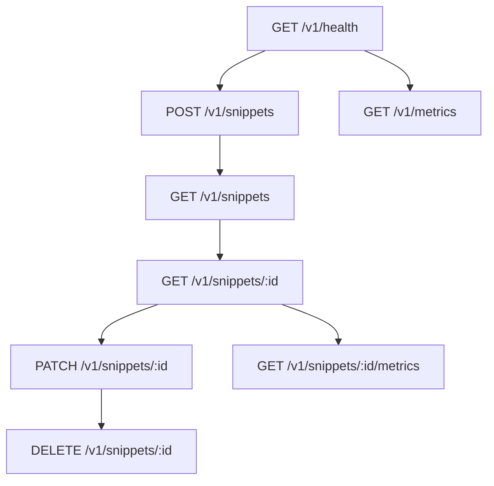

# API Documentation

## Overview

Bonsai provides a REST API for creating and managing text/code snippets. Think of it as a programmatic Pastebin or GitHub Gist service.

**Base URL**: `http://localhost:8080/v1`

**Content Type**: All endpoints accept and return `application/json`

## Error Response Format

```json
{
  "error": {
    "code": "string",
    "message": "string",
    "details": { }
  }
}
```

---

## Endpoints

### 1. Health

**GET /v1/health**

Checks service health.

**200 Response**

```json
{ "code": 200, "data": { "ok": true }, "message": "ok" }
```

---

### 2. Create Snippet

**POST /v1/snippets**

Create a new text/code snippet with optional expiry and tags. Perfect for sharing code, configs, logs, or any text content.

**Request Body**

```json
{
  "content": "def hello():\n    print('Hello World')",
  "expires_in": 86400,  // Optional: seconds until expiry (max 2592000 = 30 days)
  "tags": ["python", "example"]  // Optional: for categorization
}
```

**Use Cases**:
- Share code snippets in team chats
- Temporarily share configuration files
- Store debug logs or stack traces
- Create reusable documentation snippets

**201 Response**

```json
{
  "id": "abc123",
  "created_at": "2025-08-21T15:04:05Z",
  "expires_at": "2025-08-22T15:04:05Z",
  "tags": ["demo", "test"]
}
```

**Errors**

* 400 if content > 10KB
* 400 if expires\_in > 30 days

---

### 3. List Snippets

**GET /v1/snippets**

List snippets with pagination and optional tag filtering. Useful for browsing available snippets or finding specific categories.

**Query Parameters**

* `page` (integer, default 1) - Page number
* `limit` (integer, default 20, max 100) - Items per page
* `tag` (string, optional) - Filter by tag (e.g., "python", "config")

**200 Response**

```json
{
  "page": 1,
  "limit": 2,
  "items": [
    { "id": "abc123", "created_at": "2025-08-21T15:04:05Z", "expires_at": null },
    { "id": "def456", "created_at": "2025-08-21T15:05:05Z", "expires_at": "2025-08-22T15:05:05Z" }
  ]
}
```

---

### 4. Get Snippet by ID

**GET /v1/snippets/:id**

Retrieve the full content of a snippet. Uses Redis cache for fast retrieval of frequently accessed snippets.

**200 Response**

```json
{
  "id": "abc123",
  "content": "def hello():\n    print('Hello World')",
  "created_at": "2025-08-21T15:04:05Z",
  "expires_at": null,
  "tags": ["python", "example"]
}
```

**Response Headers**

* `X-Cache: HIT` or `MISS` - Indicates if content was served from cache

**Error Responses**

* `404 Not Found` - Snippet doesn't exist
* `410 Gone` - Snippet has expired

---

### 5. Update Snippet

Future: PATCH /v1/snippets/\:id

Updates snippet content or expiry. Invalidates cache.

**Request**

```json
{ "content": "new text", "expires_in": 172800 }
```

**200 Response**

```json
{
  "id": "abc123",
  "content": "new text",
  "expires_at": "2025-08-23T15:04:05Z"
}
```

**Errors**

* 404 if not found
* 400 for invalid fields

---

### 6. Delete Snippet

Future: DELETE /v1/snippets/\:id

Soft delete a snippet and clears cache.

**200 Response**

```json
{ "deleted": true }
```

**Errors**

* 404 if not found

---

### 7. Snippet Metrics

Future: GET /v1/snippets/\:id/metrics

Returns aggregated analytics.

**200 Response**

```json
{
  "id": "abc123",
  "total_views": 152,
  "unique_visitors": 89,
  "daily": [
    { "date": "2025-08-19", "views": 50, "uniques": 30 },
    { "date": "2025-08-20", "views": 102, "uniques": 59 }
  ],
  "trend_score": 74.2
}
```

**Errors**

* 404 if snippet not found

---

### 8. Service Metrics

Future: GET /v1/metrics

Prometheus-style metrics for ops and monitoring.

**Sample Response**

```
http_requests_total{route="/v1/snippets"} 523
cache_hits_total 420
cache_misses_total 103
ratelimit_block_total 2
events_processed_total 510
events_dlq_total 1
```

---

## Mermaid Diagram of Endpoints


