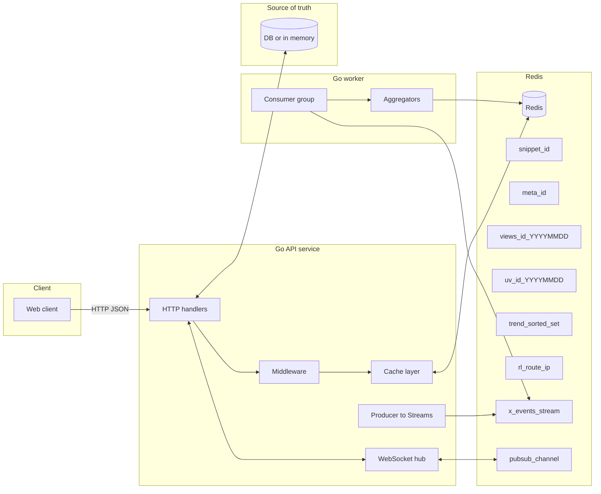
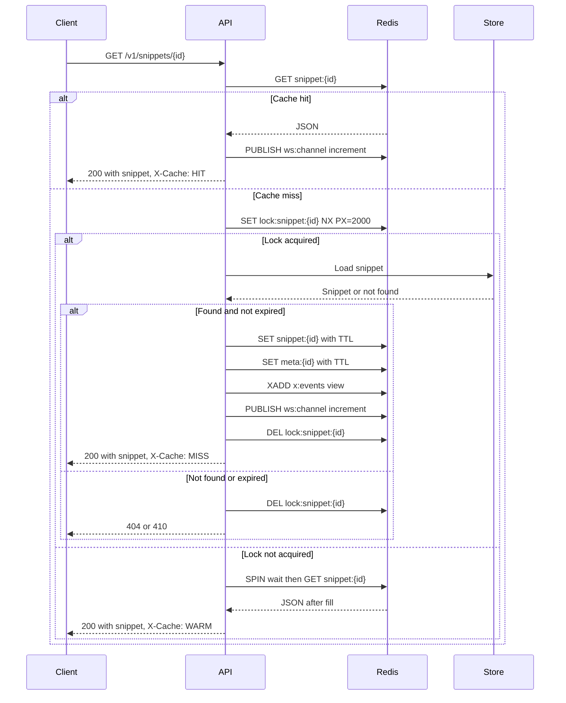
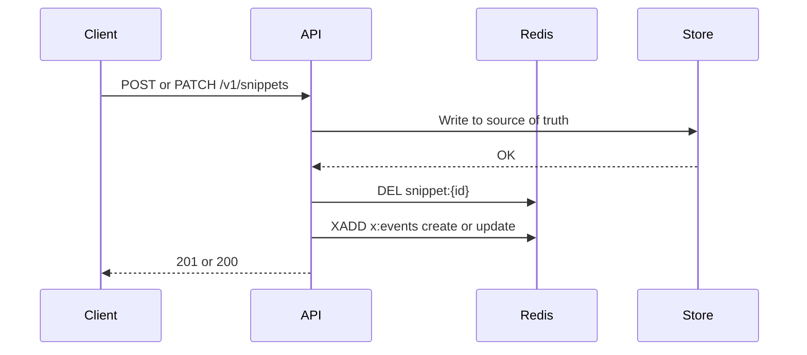
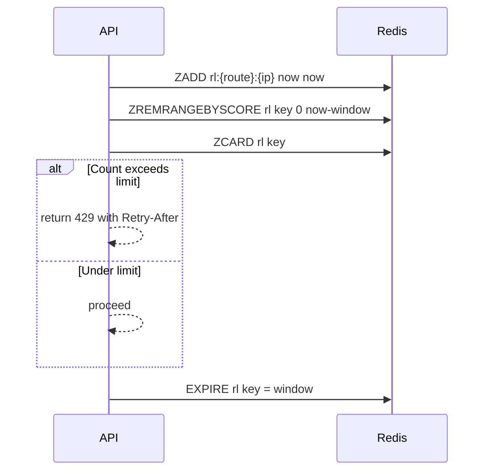
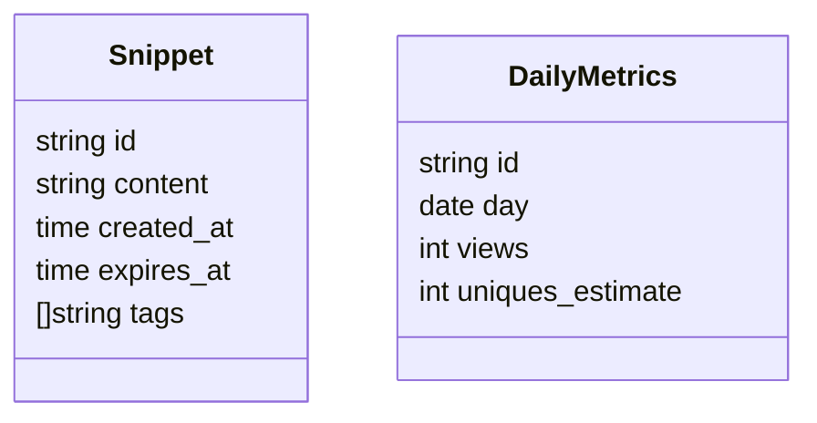
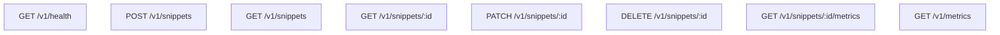

# Architecture

## 1. Components

- **API service** in Go
- **Storage** as in-memory for V1 (can swap to SQLite or Postgres later)
- **Redis** for cache, rate limiting, analytics aggregation, pubsub, streams
- **Worker service** for background aggregation and trend updates
- **Optional Web client** for viewing snippets and live counters




## 2. Data Flow

### 2.1 Read Path with Cache Aside and Stampede Guard




### 2.2 Write Path with Invalidate on Success




### 2.3 Analytics Aggregation with Streams and Worker Pool

```mermaid
flowchart LR
  A[API] -->|XADD view| X[x:events]
  subgraph Worker
    CG[XREADGROUP] --> W1[Worker 1]
    CG --> W2[Worker 2]
    CG --> Wn[Worker n]
  end
  W1 -->|INCR| V[views:{id}:{date}]
  W1 -->|PFADD| U[uv:{id}:{date}]
  W1 -->|ZINCRBY decay| T[trend]
  W1 -->|ACK| X
  W2 -->|same as above| V
  Wn -->|same as above| V
```


### 2.4 Rate Limiting with Sliding Window




## 3. Redis Keys

| Key                     | Type        | Purpose                               | TTL                          |
| ----------------------- | ----------- | ------------------------------------- | ---------------------------- |
| `snippet:{id}`          | String JSON | Hot snippet payload for reads         | min 24h and remaining expiry |
| `meta:{id}`             | Hash        | Lightweight metadata for quick checks | mirrors snippet TTL          |
| `views:{id}:{yyyyMMdd}` | Integer     | Daily view counter                    | 400 days                     |
| `uv:{id}:{yyyyMMdd}`    | HyperLogLog | Unique visitor estimate per day       | 400 days                     |
| `trend`                 | Sorted Set  | Popularity score for ranking          | none or long TTL             |
| `rl:{route}:{ip}`       | Sorted Set  | Sliding window entries                | equals window                |
| `x:events`              | Stream      | Append only events from API           | capped by trimming           |
| `lock:snippet:{id}`     | String      | Cache refill lock key                 | a few seconds                |

**Key lifecycle notes:**
- Cache keys are refreshed on access with sliding TTL logic.
- Analytics keys are write only by workers to keep API latency low.
- Stream trimming policy can be size based via XTRIM.


## 4. Concurrency Patterns

### 4.1 Stampede Protection

- In-process singleflight groups concurrent GETs for the same id.
- Cross-process lock with SET NX and a short TTL guards the refill.
- Waiting callers poll with jitter and a small bounded backoff.

### 4.2 Worker Pool

- One consumer group name per deployment.
- Each worker goroutine handles an event with context timeout.
- On failure the event is NACKed and moved to a dead letter stream for later inspection.

### 4.3 PubSub and WebSocket

- API publishes a compact increment message for a snippet id.
- WebSocket hub fans out to subscribed clients with bounded channels per connection to avoid unbounded memory use.
- On overflow the oldest message is dropped to preserve liveness.

### 4.4 Graceful Shutdown

- API and worker listen for SIGTERM.
- Stop accepting new HTTP requests or stream claims, drain in-flight work, flush metrics, close Redis connections.


## 5. Data Model



Source of truth can be swapped without changing cache logic. Keep storage mutations simple and let the cache derive from it.


## 6. API Surface



**Response shape:**
- JSON only
- Consistent error envelope with code, message, details
- `X-Cache` header reports HIT or MISS


## 7. Operational Notes

**Configuration:**
- Redis address
- HTTP listen address
- Log level
- Stream consumer group name

**Metrics to watch:**
- Cache hit and miss rates
- Rate limit denials
- Stream lag and pending counts
- Worker backlog and processing latency
- WebSocket client count

**Alerts:**
- Cache hit rate drops below a threshold
- Stream pending length grows beyond a threshold
- p95 latency crosses target for sustained period


## 8. Performance Targets

- Redirect style reads under 10 ms from cache at p95 on local Docker setup
- Under 50 ms overall for cold reads at p95
- Worker keeps up with event volume with backlog under a few hundred entries
